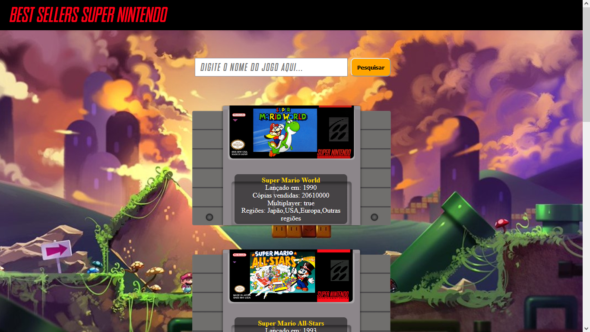

<h1 align="center"> Best Sellers Super Nintendo  
 
</h1>

  <a href="#Tecnologias">Tecnologias</a>&nbsp;&nbsp;&nbsp;|&nbsp;&nbsp;&nbsp;
   <a href="#Projeto">Projeto</a>&nbsp;&nbsp;&nbsp;|&nbsp;&nbsp;&nbsp;
  <a href="#Instalação">Instalação</a>&nbsp;&nbsp;&nbsp;|&nbsp;&nbsp;&nbsp;
  <a href="#Imagens">Imagens</a>&nbsp;&nbsp;&nbsp;|&nbsp;&nbsp;&nbsp;
  

## 🚀 Tecnologias 

Esse projeto foi desenvolvido com as seguintes tecnologias:

- Javascript
    - Variáveis
    - Operadores
    - Strings
    - Arrays
    - Objetos
    - Condicionais
    - Laços
    - Funções
    - Funções de Array
- HTML e CSS
    - HTML semântico
    - Flex e Grid
    - DOM e responsividade

## 💻 Projeto

Esta aplicação consiste numa lista com os jogos mais vendidos para Super Nintendo.

A aplicação é simples de usar, basta pesquisar o nome do jogo na barra de pesquisa. Se o jogo estiver entre os 5 mais vendidos do SNES, será renderizado o cartucho com as informações do jogo.

## Link deploy  
[Github Pages](https://devluizfelipe.github.io/projeto-intro-web/)

## 👨‍💻 Instalação na sua máquina:

1. Faça o download e extração do projeto;
2. Abra o arquivo index.html com seu navegador;
3. Pronto, agora é só testar a aplicação.

### Imagens

## 🖼️ Imagens 
 HomePage | |
 |---|---|

 HomePagePhone | |
|---|---|

## 💼 Feito por: 

### Luiz Felipe:
 

